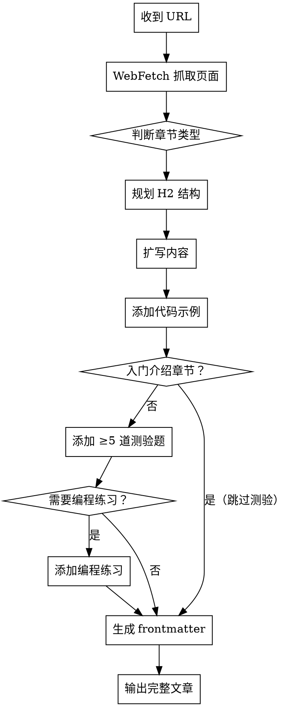

# Rust Tutorial Writer（本项目专用）

## 项目背景

本 skill 专用于 `rust_course_web` Astro 教程项目。文章放在 `src/content/chapters/`，图片放在 `public/diagrams/`，完整语法参考见 `docs/内容编写指南.md`，示例文章在 `docs/examples/chapters/`。

## 流程



## 第一步：抓取与分析

用 WebFetch 读取 URL，提取：
- 核心概念列表
- 官方代码示例
- 所有规则/约束
- 官方的「注意」「警告」「提示」callout

## 第二步：判断章节类型

**入门介绍章节（不加测验）**：「什么是 Rust」「为什么用 Rust」「安装环境」「Hello World」「历史背景」等。

**技术章节（必须加测验，酌情加编程题）**：任何涉及语法、语义、所有权、借用、生命周期、类型系统、trait、错误处理、并发等内容。不确定时，默认加测验。

## 第三步：规划 H2 结构

- `# ` — 每篇只有一个，与 frontmatter `title` 一致
- `## ` — 主要概念节（自动出现在右侧目录，进度系统按此拆分）
- `### ` — 子概念

每篇技术文章目标 4-8 个 `##` 节。典型结构：

```
# [主题名称]

## 为什么需要它（背景与动机）
## 基本语法
## 工作原理（底层机制）
## 常见使用模式
## 常见错误与编译器提示
## 与相关概念的对比（可选）
## 小结
```

## 第四步：扩写内容

**比官方更多意味着：**
- 加类比（所有权 ≈ 快递签收单）
- 解释每条规则背后的「为什么」（Rust 这样设计是因为……）
- 用 `expect-error` 展示违反规则时的编译错误
- 补充官方跳过的边界情况
- `> ` 引用块用于重要提示和警告

**语气**：口语化、有耐心、假设读者聪明但对 Rust 陌生。

## 第五步：代码示例

本项目 Markdown 中所有代码块都有特殊渲染，使用以下格式：

**标准可运行块：**
````markdown
```rust runnable
fn main() {
    println!("带中文注释的完整示例");
}
```
````

**隐藏样板代码（`# ` 开头的行页面上不显示，但实际执行）：**
````markdown
```rust runnable
# fn main() {
    let s1 = String::from("hello");
    let s2 = s1;
    println!("{}", s2);
# }
```
````

**演示编译错误：**
````markdown
```rust runnable expect-error
# fn main() {
    let s1 = String::from("hello");
    let s2 = s1;
    println!("{}", s1); // 错误：s1 已失效
# }
```
````

每个 `##` 节至少一个可运行代码示例。

## 第六步：测验题（技术章节）

每篇技术文章最少 **5 道题**，单选与多选混搭，覆盖不同 `##` 节。

**单选格式：**
````markdown
```quiz single
Q: [具体明确的问题]
- [错误选项]
- [错误选项]
+ [正确选项]
- [错误选项]
E: [解析：说明正确答案，并点出常见误区]
```
````

**多选格式：**
````markdown
```quiz multi
Q: 下列哪些关于 [概念] 的说法是正确的？
+ [正确]
- [错误]
+ [正确]
- [错误]
E: [解析说明]
```
````

**好题标准：**
- 测理解，不测背语法
- 错误选项是初学者真的会选的
- 至少一道题涉及「哪段代码无法编译」
- 解析内容对应文章正文

## 第七步：编程练习

以下场景酌情添加编程练习：涉及读者需要动手写的新语法、常用模式、修复错误（尤其是所有权/借用/生命周期相关）。

````markdown
## 编程练习

[描述问题背景]，请[修复/补全/实现]使其输出正确结果。

```rust editable
fn main() {
    // TODO 或有错的代码
}
```

```expected
预期输出
```
````

编程练习放在文章末尾或对应 `##` 节末尾。

## 第八步：生成 frontmatter

```yaml
---
title: "[清晰的中文标题，与 # 标题一致]"
description: "[一句话说明本文讲什么 + 学完能做什么，≤ 40 字]"
difficulty: beginner   # beginner / intermediate / advanced
estimatedTime: 20      # 包含代码练习和测验的诚实估计（分钟）
keywords: ["关键词1", "关键词2", "关键词3"]
---
```

**难度参考：**
- `beginner`：语法、基础类型、控制流、函数、Hello World
- `intermediate`：所有权、借用、生命周期、trait、泛型、错误处理
- `advanced`：高级 trait、unsafe、宏、并发、异步

**estimatedTime 参考：**
- 纯讲解：10-20 分钟
- 含代码练习：+5-10 分钟
- 含测验：+5 分钟

## 输出要求

直接输出完整 Markdown 文件内容，从 frontmatter `---` 开始，不要加外层代码块，不要加额外注释。

文章较长时按节输出并确认，不要截断。

## 文件存放位置

- 文章：`src/content/chapters/NN-章节名/NN-文章名.md`
- 图片：`public/diagrams/` 目录，引用路径 `/RustCourse/diagrams/文件名.svg`
- 命名约定：`00-` 开头为章节首页，其余按字母序排列决定顺序
