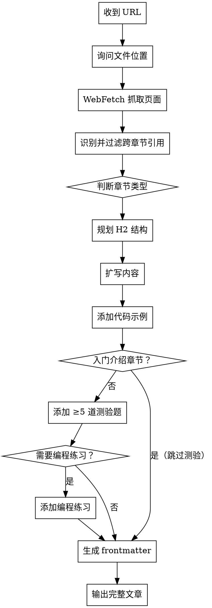

# Rust Tutorial Writer（本项目专用）

## 项目背景

本 skill 专用于 `rust_course_web` Astro 教程项目。文章放在 `src/content/chapters/`，图片放在 `public/diagrams/`，完整语法参考见 `docs/内容编写指南.md`，示例文章在 `docs/examples/chapters/`。

## Markdown 格式约定

- **加粗**：新写内容统一使用 `**bold**`，不使用 `__bold__`。注意：不要去修改已有文章中的 `__bold__`，那是作者有意为之的保留用法。
- **斜体**：使用 `*italic*`
- **代码块**：必须标注语言（`rust`、`bash`、`text` 等），不写裸 ` ``` `

## 流程

**第一件事：询问文件位置（见第零步）。**



## 第零步：询问文件位置（开始前必须做）

抓取页面之前，先问用户：

> 这篇文章放在哪个章节目录下，文件名是什么？
> 例如：`src/content/chapters/02-ownership/01-ownership-rules.md`

等用户回答后再继续。如果用户已经在消息里提供了路径，跳过此询问。

## 第一步：抓取与分析

用 WebFetch 读取 URL，提取：
- 核心概念列表
- 官方代码示例
- 所有规则/约束
- 官方的「注意」「警告」「提示」callout
- **所有跨章节引用**（见第二步）

## 第二步：识别并过滤跨章节引用

原文可能包含类似以下的内容：

> "我们将在第 10 章讲解 trait"
> "第 15 章会介绍智能指针"
> "更多细节见第 XX 章"
> "这超出了本书当前部分的范围"

**处理规则：**
- 扫描全文，列出所有「将在 X 章讲」「详见 X 章」「暂不展开」类表述
- 这些内容**不要在文章中提及**（本教程的章节规划与官方 The Book 不同）
- 如果某概念被官方推迟讲但对当前文章理解有帮助，可以简短说明「先有个印象，后续会详细介绍」，但**不能给出具体章节号**
- 如果整段内容依赖另一章尚未讲的概念，跳过该段，不要引入读者还没学到的内容

## 第三步：判断章节类型

**入门介绍章节（不加测验）**：「什么是 Rust」「为什么用 Rust」「安装环境」「Hello World」「历史背景」等。

**技术章节（必须加测验，酌情加编程题）**：任何涉及语法、语义、所有权、借用、生命周期、类型系统、trait、错误处理、并发等内容。不确定时，默认加测验。

## 第四步：规划 H1 标签页 + H2 结构

### H1 标签页机制（重要）

本项目的 `SectionProgress` 组件会检测文章中的 `# H1` 标题：

- **有多个 H1** → 自动渲染顶部 Tab 栏，每个 H1 是一个独立 Tab Panel，读者可切换，**每个 Tab 有独立进度**
- **无 H1（或只有一个）** → 整篇文章作为一个整体，底部「完成」按钮标记全文已读

**写文档时要灵活利用这一点：**

| 文章类型 | 推荐 Tab 拆分方式 |
|----------|-----------------|
| 练习文章 | 每个主题一个 Tab（如「变量练习」「函数练习」「所有权练习」） |
| 长技术文章 | 「理论」Tab + 「代码实战」Tab + 「常见错误」Tab |
| 包含多个独立概念的文章 | 每个概念一个 Tab |
| 短文章（< 800 字） | 不拆 Tab，单一整体 |

**Tab 设计原则：**
- 每个 Tab 要有实质内容，不要为了拆而拆
- 同一 Tab 内的测验/编程题贡献该 Tab 的进度
- Tab 名（即 H1 标题）要简洁，不超过 8 个字
- 读者切换 Tab 时不应感到「上下文断裂」——每个 Tab 最好能相对独立阅读

**示例结构（练习文章）：**
```markdown
# 变量与类型
## 单选：变量声明
```quiz single ...```

## 编程练习
```rust editable ...```

# 控制流
## 单选：if 表达式
...

# 函数
## 多选：函数特性
...
```

### H2 结构（TOC 与进度节点）

- `# ` — Tab 标题（可选，有则生成 Tab 栏）
- `## ` — 主要概念节（出现在右侧目录，进度系统按此拆分）
- `### ` — 子概念

每个 Tab（或无 Tab 时整篇）目标 3-6 个 `##` 节。典型结构：

```
# [Tab 名称]

## 为什么需要它（背景与动机）
## 基本语法
## 工作原理
## 常见错误
## 小结
```

## 第五步：扩写内容

**比官方更多意味着：**
- 加类比（所有权 ≈ 快递签收单）
- 解释每条规则背后的「为什么」（Rust 这样设计是因为……）
- 用 `expect-error` 展示违反规则时的编译错误
- 补充官方跳过的边界情况
- `> ` 引用块用于重要提示和警告
- **不引入原文中被推迟到其他章节的概念**

**语气**：口语化、有耐心、假设读者聪明但对 Rust 陌生。

## 第六步：代码示例

本项目 Markdown 中所有代码块都有特殊渲染，使用以下格式：

**标准可运行块：**
````markdown
```rust runnable
fn main() {
    println!("带中文注释的完整示例");
}
```
````

**隐藏样板代码（`# ` 开头的行页面上不显示，但实际执行）：**
````markdown
```rust runnable
# fn main() {
    let s1 = String::from("hello");
    let s2 = s1;
    println!("{}", s2);
# }
```
````

**演示编译错误：**
````markdown
```rust runnable expect-error
# fn main() {
    let s1 = String::from("hello");
    let s2 = s1;
    println!("{}", s1); // 错误：s1 已失效
# }
```
````

每个 `##` 节至少一个可运行代码示例。

## 第七步：测验题（技术章节）

每篇技术文章最少 **5 道题**，单选与多选混搭，覆盖不同 `##` 节。

**单选格式：**
````markdown
```quiz single
Q: [具体明确的问题]
- [错误选项]
- [错误选项]
+ [正确选项]
- [错误选项]
E: [解析：说明正确答案，并点出常见误区]
```
````

**多选格式：**
````markdown
```quiz multi
Q: 下列哪些关于 [概念] 的说法是正确的？
+ [正确]
- [错误]
+ [正确]
- [错误]
E: [解析说明]
```
````

**好题标准：**
- 测理解，不测背语法
- 错误选项是初学者真的会选的
- 至少一道题涉及「哪段代码无法编译」
- 解析内容对应文章正文
- **不出涉及原文中被推迟章节的题目**

## 第八步：编程练习

以下场景酌情添加编程练习：涉及读者需要动手写的新语法、常用模式、修复错误（尤其是所有权/借用/生命周期相关）。

````markdown
## 编程练习

[描述问题背景]，请[修复/补全/实现]使其输出正确结果。

```rust editable
fn main() {
    // TODO 或有错的代码
}
```

```expected
预期输出
```
````

编程练习放在文章末尾或对应 `##` 节末尾。

## 第九步：生成 frontmatter

```yaml
---
title: "[清晰的中文标题，与 # 标题一致]"
description: "[一句话说明本文讲什么 + 学完能做什么，≤ 40 字]"
difficulty: beginner   # beginner / intermediate / advanced
estimatedTime: 20      # 包含代码练习和测验的诚实估计（分钟）
keywords: ["关键词1", "关键词2", "关键词3"]
---
```

**难度参考：**
- `beginner`：语法、基础类型、控制流、函数、Hello World
- `intermediate`：所有权、借用、生命周期、trait、泛型、错误处理
- `advanced`：高级 trait、unsafe、宏、并发、异步

**estimatedTime 参考：**
- 纯讲解：10-20 分钟
- 含代码练习：+5-10 分钟
- 含测验：+5 分钟

## 输出要求

直接输出完整 Markdown 文件内容，从 frontmatter `---` 开始，不要加外层代码块，不要加额外注释。

文章较长时按节输出并确认，不要截断。

## 文件存放位置

- 文章：用户在第零步确认的路径
- 图片：`public/diagrams/` 目录，引用路径 `/RustCourse/diagrams/文件名.svg`
- 命名约定：`00-` 开头为章节首页，其余按字母序排列决定顺序
